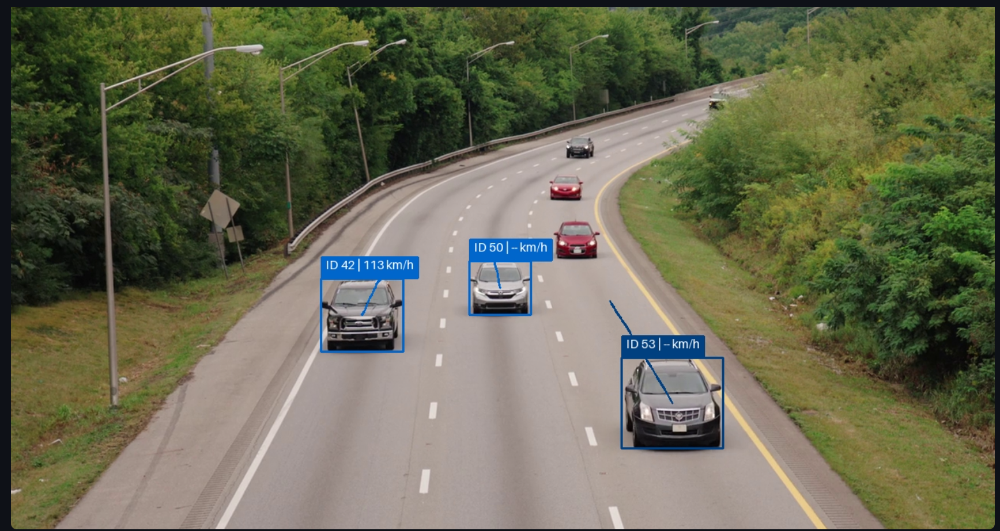

# Vehicle Speed Detection using YOLO, Supervision and Streamlit

A real-time vehicle detection, tracking, and speed estimation application built using **YOLO11**, **Supervision**, **OpenCV**, and **Streamlit**.




The application allows users to upload a traffic video and processes it frame-by-frame. Vehicles are detected and tracked using YOLO, while their movement is mapped from image coordinates to real-world coordinates using a perspective transformation. The estimated speed is displayed directly on each vehicle.
The application allows users to upload a traffic video and processes it frame-by-frame. Vehicles are detected and tracked using YOLO, while their movement is mapped from image coordinates to real-world coordinates using a perspective transformation. The estimated speed is displayed directly on each vehicle.


## Features

* Upload traffic videos directly through Streamlit
* Real-time video processing
* Vehicle detection using YOLO11
* Vehicle tracking using ByteTrack
* Detects:

  * Cars
  * Buses
  * Trucks
* Unique ID assigned to each tracked vehicle
* Real-time speed estimation in km/h
* Vehicle bounding boxes
* Vehicle movement traces
* Live speed labels
* Perspective transformation for real-world distance estimation
* Supports MP4, AVI, MOV, and MKV videos
* Color video output with annotations

## Technologies Used

* Python
* YOLO11
* Ultralytics
* OpenCV
* Supervision
* NumPy
* Streamlit
* ByteTrack
* uv

## Project Structure

```text
vehicle-speed-detection/
│
├── app.py
├── yolo11m.pt
├── pyproject.toml
├── uv.lock
└── README.md
```

## Installation

This project uses **uv** for Python environment and dependency management.

### Install uv

If `uv` is not already installed, install it using the official installation instructions.

On Windows:

```powershell
powershell -ExecutionPolicy ByPass -c "irm https://astral.sh/uv/install.ps1 | iex"
```

Verify the installation:

```bash
uv --version
```

### Clone the Repository

```bash
git clone https://github.com/your-username/vehicle-speed-detection.git
```

Move into the project directory:

```bash
cd vehicle-speed-detection
```

### Create the Virtual Environment

Create a virtual environment using `uv`:

```bash
uv venv
```

Activate it on Windows:

```bash
.venv\Scripts\activate
```

For macOS/Linux:

```bash
source .venv/bin/activate
```

### Install Dependencies

Add the required dependencies using:

```bash
uv add streamlit ultralytics supervision==0.24.0 opencv-python numpy lapx
```

This will create/update:

```text
pyproject.toml
uv.lock
```

`uv.lock` ensures that the project's dependency versions can be reproduced consistently.

### Install Dependencies from an Existing Project

If `pyproject.toml` and `uv.lock` are already included in the repository, simply run:

```bash
uv sync
```

This will create the virtual environment and install the dependencies defined by the project.

## YOLO Model

This project uses:

```text
yolo11m.pt
```

Place the model file in the same directory as `app.py`.

The model can be changed depending on your hardware:

```text
yolo11n.pt
yolo11s.pt
yolo11m.pt
yolo11l.pt
yolo11x.pt
```

For faster processing on lower-end systems, `yolo11n.pt` or `yolo11s.pt` can be used.

For better detection accuracy, `yolo11m.pt` or larger models can be used.

## Run the Application

After installing the dependencies, run the Streamlit application using:

```bash
uv run streamlit run app.py
```

Alternatively, if the virtual environment is activated:

```bash
streamlit run app.py
```

After starting the application, Streamlit will provide a local URL.

Open the URL in your browser to use the application.

## How It Works

The system follows this pipeline:

```text
                Upload Video
                     │
                     ▼
             OpenCV VideoCapture
                     │
                     ▼
                YOLO11 Detection
                     │
                     ▼
               ByteTrack Tracking
                     │
                     ▼
            Vehicle Tracking IDs
                     │
                     ▼
           Bottom-Center Point
                     │
                     ▼
          Perspective Transformation
                     │
                     ▼
          Real-World Coordinates
                     │
                     ▼
             Distance / Time
                     │
                     ▼
              Speed in km/h
                     │
                     ▼
            Streamlit Live Display
```

## Vehicle Detection

The application uses the following YOLO classes:

```python
classes = [2, 5, 7]
```

These correspond to:

| Class ID | Vehicle |
| -------: | ------- |
|        2 | Car     |
|        5 | Bus     |
|        7 | Truck   |

The model tracks each detected vehicle and assigns a unique ID:

```text
ID 1
ID 2
ID 3
...
```

## Speed Estimation

The application tracks the bottom-center point of each vehicle's bounding box.

```text
        ┌───────────────┐
        │    Vehicle    │
        │               │
        └───────●───────┘
                ↑
        Bottom-center point
```

The point is transformed from image coordinates into real-world coordinates using a perspective transformation.

The speed is calculated using:

```text
Speed = Distance / Time
```

The result is converted from m/s to km/h:

```text
km/h = m/s × 3.6
```

## Perspective Transformation

Because the camera observes the road from an angle, pixel movement does not directly correspond to real-world movement.

The application therefore uses four points on the road:

```text
A ---------------- B
|                    |
|       ROAD         |
|                    |
D ---------------- C
```

These points are mapped to real-world coordinates:

```text
A → (0, 0)
B → (32, 0)
C → (32, 140)
D → (0, 140)
```

This creates a relationship between the camera view and the physical road.

## Important: Calibration

**Speed estimation depends heavily on correct calibration.**

The following coordinates are specific to the original M6 motorway video:

```python
image_pts = [
    (800, 410),
    (1125, 410),
    (1920, 850),
    (0, 850)
]
```

And:

```python
world_pts = [
    (0, 0),
    (32, 0),
    (32, 140),
    (0, 140)
]
```

If you use a different camera angle or different video, these values **must be recalibrated**.

Otherwise, the application may produce inaccurate speeds such as:

```text
150 km/h
200 km/h
0 km/h
```

even when the actual vehicle speed is much lower.

## Recommended Calibration

For a more accurate real-world system, the application should allow the user to select four points from the uploaded video's road surface.

For example:

```text
       Camera View

       A -------- B
        \        /
         \      /
          \    /
           \  /
            \/
            C
            |
            |
            D
```

The user should then provide the actual physical dimensions of the selected road area.

For example:

```text
Width  = 32 meters
Length = 140 meters
```

This allows the perspective transformation to be adapted to each camera.

## Real-Time Processing

The application does not first generate the complete output video.

Instead, it processes frames continuously:

```text
Frame 1
   ↓
YOLO
   ↓
Tracking
   ↓
Speed
   ↓
Display

Frame 2
   ↓
YOLO
   ↓
Tracking
   ↓
Speed
   ↓
Display

Frame 3
   ↓
YOLO
   ↓
Tracking
   ↓
Speed
   ↓
Display
```

Therefore, the processed frame appears immediately in the Streamlit interface.

When the video finishes, processing stops automatically.

## Example Output

The application displays labels such as:

```text
ID 1 | 52 km/h
ID 2 | 67 km/h
ID 3 | 48 km/h
```

Vehicles are also displayed with:

* Bounding boxes
* Tracking IDs
* Movement traces
* Estimated speed

## Accuracy Considerations

This system is a **computer-vision-based speed estimation system**, not a certified speed-measuring device.

Accuracy depends on:

* Camera position
* Camera angle
* Perspective calibration
* Actual road dimensions
* Video resolution
* FPS
* Vehicle detection accuracy
* Tracking stability
* Occlusion
* Motion blur
* Camera movement

For reliable speed estimation, the camera should ideally be:

* Fixed
* Stable
* High enough to observe the road
* Positioned so vehicles remain visible for sufficient time
* Calibrated using known road measurements

## Performance

YOLO11 model selection affects processing speed.

| Model   | Speed     | Accuracy |
| ------- | --------- | -------- |
| YOLO11n | Very Fast | Lower    |
| YOLO11s | Fast      | Good     |
| YOLO11m | Moderate  | Better   |
| YOLO11l | Slow      | High     |
| YOLO11x | Very Slow | Highest  |

For a laptop without a dedicated GPU, start with:

```python
YOLO("yolo11n.pt")
```

or:

```python
YOLO("yolo11s.pt")
```

For better accuracy with a GPU:

```python
YOLO("yolo11m.pt")
```

## Future Improvements

Possible improvements include:

* Automatic road calibration
* Interactive four-point selection
* Automatic measurement of road distance
* Better speed smoothing
* Vehicle direction detection
* Speed-limit violation detection
* Number plate detection
* Number plate recognition
* Vehicle type classification
* Vehicle counting
* Lane detection
* Speed violation alerts
* CSV/Excel speed reports
* Database storage
* GPU acceleration
* Multi-camera support

## Future Number Plate Integration

The system can also be extended to combine vehicle speed estimation with number plate recognition:

```text
Traffic Video
      │
      ▼
YOLO Vehicle Detection
      │
      ▼
Vehicle Tracking
      │
      ├────────────────┐
      ▼                ▼
Speed Estimation   Number Plate Detection
      │                │
      │                ▼
      │           OCR / Plate Recognition
      │                │
      └────────┬───────┘
               ▼
        Vehicle Record
               │
               ▼
      ID | Speed | Number Plate
```

For example:

```text
Vehicle ID: 12
Speed: 72 km/h
Number Plate: OD 02 AB 1234
```

## Disclaimer

The estimated speed is dependent on camera calibration and video quality. This project is intended for **educational, research, and prototype purposes** and should not be used as a certified enforcement system without proper calibration and validation.

## License

This project is intended for educational and research purposes. You can modify and extend it according to your project requirements.
